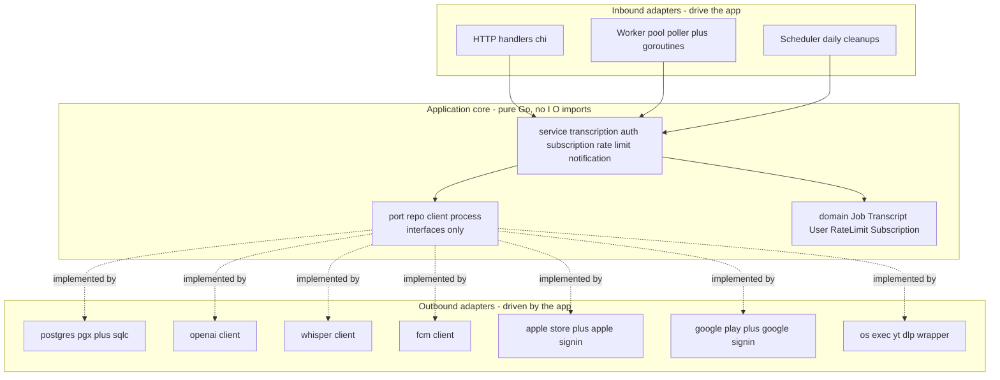

# Go Port Plan — content-categorise

This document is the source of truth for porting `content-categorise` (Spring Boot 3.5 / Java 21) to Go. It is structured so each phase can be executed in a separate agent session: every phase lists its inputs, the files it produces, and acceptance criteria that the agent can verify before declaring the phase done.

> **Status**: planning complete, no code written yet.
> **Target repo**: a new repo (e.g. `content-categorise-go`), separate from this one.
> **Deployment cutover**: big-bang. The current Java service is **not in production**, so we can swap whenever the Go version is ready.
> **Wire compatibility**: every endpoint stays byte-identical to the Java responses unless an explicit divergence is listed in [§9 API surface](#9-api-surface--wire-compatible-by-default).

---

## 1. Goals

1. **Cut runtime cost**: target a single binary at ~80–150 MB RSS during transcription (vs JVM 250–500 MB baseline). Container image ~80–100 MB (vs ~400 MB JRE+jar). Should run on a $5–10/mo 1 vCPU / 1 GB VM.
2. **Leverage Go idioms**: small interfaces defined by consumers; goroutines + channels for in-process dispatch; `os/exec` with `context.WithTimeout` for subprocess control; `pgx` over JDBC; `slog` over Logback.
3. **Hexagonal (ports + adapters) architecture**: a pure core (`domain` + `service`) that knows nothing about HTTP, Postgres, or OpenAI. All I/O lives behind interfaces in `internal/port/*`, implemented by adapters in `internal/adapter/*`.
4. **Keep the iOS contract**: the iOS app at `~/personal/TranscribeAssistant-ios` must keep working without changes. Wire-identical defaults, with explicit call-outs for every divergence we choose.

## 2. What we are replacing

Spring Boot 3.5 / Java 21 monolith. ~163 Java files, ~11 171 lines under `src/main/java`. Postgres + Flyway (V1..V24). Three auth modes (Google, Apple, local), two billing integrations (Apple App Store Server API, Google Play Developer API), one transcription pipeline (yt-dlp → Whisper → gpt-4o), one push-notification path (FCM).

The full source-side inventory lives at the bottom of this doc in [Appendix A — Source repo reference](#appendix-a--source-repo-reference). Future sessions can read that appendix instead of re-exploring the Java code.

## 3. Channels vs separate worker process — decision

These are not alternatives; they live at different layers and we use both.

- **In-process**: a buffered channel + a small goroutine worker pool dispatches claimed jobs. Replaces Spring's `mediaExecutor` (`corePoolSize=2, maxPoolSize=4, queueCapacity=20, CallerRunsPolicy`) from `config/AsyncConfig.java`. Backpressure semantics are identical: when the channel is full, the poller blocks (== `CallerRunsPolicy`).
- **Cross-process**: PostgreSQL `SELECT ... FOR UPDATE SKIP LOCKED` is the queue. Already implemented at `data/repository/TranscriptionJobRepositoryImpl.claimNextPending()`. Multiple binaries against the same DB never double-claim. **No external broker (NATS/Redis) is needed** and adding one would only add infra cost.

**Decision: one binary with a `--mode={api,worker,both}` flag (default `both`).**

- Day one: `--mode=both`, single container, smallest possible footprint.
- Later, if needed: run additional `--mode=worker` containers; no code change. The Postgres claim query keeps them safe.
- Cost of optionality is one if-block in `main` and one CLI flag — pay it now.

## 4. Hexagonal architecture & where interfaces live



**Where interfaces live**: all outbound interfaces live in `internal/port/*`, **inside the application core**. This is the canonical hexagonal answer and the cleanest fit for Go.

- The core declares what it needs (outbound ports). Adapters import the core and implement the interfaces. The core has zero imports from any adapter package — it doesn't even know Postgres exists.
- Inbound adapters (HTTP, worker, cron) hold a pointer to a service struct. **No inbound interfaces** — services are concrete structs because there is exactly one implementation. Adding inbound interfaces would be ceremony with no benefit.
- `cmd/server/main.go` is the **composition root**: it constructs every adapter and wires them into services.
- Interfaces are **small and consumer-driven** (Go idiom): `port/repo/job_repo.go` exposes only the methods `service/transcription` actually calls. The same Postgres struct can satisfy multiple narrow interfaces.

`domain` types are plain Go structs + state-machine helpers (e.g. `Job.MarkProcessing()`, `Job.IsRetryableError(err)`) with **no I/O dependencies**. This mirrors the Java `domain/model/` package and lets us port the retry classifier in `TranscriptionJobService.isTransientFailure` verbatim into a pure function.

**Compositional rule** (CI-enforced via [`go-arch-lint`](https://github.com/fe3dback/go-arch-lint) or a small import-checking test):

- `domain` imports: stdlib only.
- `port` imports: `domain` + stdlib.
- `service` imports: `domain`, `port`, stdlib. **Never** an adapter package.
- `adapter` imports: `domain`, `port`, `service`, anything external.
- `cmd/server` imports: everything.

## 5. Repo layout

```
content-categorise-go/
  cmd/
    server/
      main.go                      # composition root, --mode flag, signal handling
  internal/
    config/                        # env + .env loading, typed Config struct
    log/                           # slog setup
    domain/                        # PURE: no imports outside stdlib
      job.go                       # Job + JobStatus + state transitions + retry classifier
      transcript.go                # BaseTranscript, UserTranscript
      user.go
      category.go
      ratelimit.go
      subscription.go
      device.go
      platform.go                  # VideoPlatform enum + fromURL
    port/                          # interfaces only (the "ports")
      repo/
        job_repo.go
        transcript_repo.go
        user_repo.go
        category_repo.go
        subscription_repo.go
        ratelimit_repo.go
        device_repo.go
        ...
      client/
        openai.go
        whisper.go
        fcm.go
        apple_store.go
        google_play.go
        apple_signin.go
        google_signin.go
      process/
        executor.go                # Run(ctx, timeout, argv...) (string, error)
    service/                       # use cases (concrete structs)
      transcription/
        service.go                 # createOrGetExisting, markCompleted, handleFailure
        pipeline.go                # full yt-dlp -> whisper -> openai pipeline
      auth/
      subscription/
      ratelimit/
      transcript/
      category/
      notification/
      user/
    adapter/                       # the "connections" layer
      inbound/
        http/
          server.go                # chi router, middleware
          jwt_middleware.go
          error_envelope.go
          handler/
            auth.go
            video.go
            job.go
            transcript.go
            category.go
            subscription.go
            device.go
            untranscribed_link.go
            webhook_apple.go
            webhook_google.go
        worker/
          pool.go                  # goroutine pool + channel + semaphore
          poller.go                # claim loop using SELECT FOR UPDATE SKIP LOCKED
          recovery.go              # startup: reset PROCESSING -> PENDING
        cron/
          cleanup.go               # daily job + rate-limit cleanup tickers
      outbound/
        postgres/
          pool.go
          job_repo.go
          transcript_repo.go
          ...
          queries/                 # sqlc input .sql files
        openai/
          client.go                # gpt-4o classify + structured-content extract
        whisper/
          client.go                # multipart POST to /v1/audio/transcriptions
        fcm/
          client.go                # firebase admin SDK
          noop.go                  # used when firebase.enabled=false
        applestore/
          client.go                # ES256 JWT, App Store Server API
          signin.go                # JWKS fetch (cached) + token verify
        googleplay/
          client.go                # androidpublisher SDK
          signin.go                # idtoken verifier
        ytdlp/
          executor.go              # implements port/process.Executor via os/exec
  db/
    migrations/                    # ported from Flyway V1..V24
  api/
    openapi.yaml
  Dockerfile
  docker-compose.yml
  Makefile
  go.mod
  README.md
  AGENTS.md                        # short pointer to this doc
```

## 6. Library choices

Pinned for low weight + clean DX. All chosen so future sessions don't have to revisit the decision.

- **HTTP**: [`github.com/go-chi/chi/v5`](https://github.com/go-chi/chi). Std `net/http` compatible, zero overhead.
- **DB driver**: [`github.com/jackc/pgx/v5`](https://github.com/jackc/pgx). Native Postgres protocol, faster + lower alloc than `database/sql + lib/pq`.
- **Query layer**: [`sqlc`](https://github.com/sqlc-dev/sqlc). Generates type-safe Go from `.sql` files. Repo adapters become ~5-line wrappers; SQL stays in `.sql` files.
- **Migrations**: [`github.com/pressly/goose/v3`](https://github.com/pressly/goose). Run programmatically from the binary at startup. Embed migrations via `embed.FS`. No JVM sidecar.
- **JWT**: [`github.com/golang-jwt/jwt/v5`](https://github.com/golang-jwt/jwt). HS512 for app tokens, RS256/ES256 for Apple verify.
- **Google Sign-In**: [`google.golang.org/api/idtoken`](https://pkg.go.dev/google.golang.org/api/idtoken).
- **Google Play API**: [`google.golang.org/api/androidpublisher/v3`](https://pkg.go.dev/google.golang.org/api/androidpublisher/v3). Same SDK family the Java code uses.
- **Firebase / FCM**: [`firebase.google.com/go/v4`](https://pkg.go.dev/firebase.google.com/go/v4). Official SDK; mirrors the Java `firebase-admin` semantics.
- **Apple App Store + Apple Sign-In**: hand-rolled `net/http` + `golang-jwt`. The Java code already does it by hand against `https://api.storekit.itunes.apple.com` and `https://appleid.apple.com/auth/keys`.
- **Logging**: stdlib [`log/slog`](https://pkg.go.dev/log/slog) with JSON handler in prod.
- **Config**: stdlib `flag` + `os.Getenv` + [`github.com/joho/godotenv`](https://github.com/joho/godotenv) for `.env` parity.
- **Tests**: stdlib `testing` + [`github.com/stretchr/testify/require`](https://github.com/stretchr/testify) + [`github.com/testcontainers/testcontainers-go`](https://github.com/testcontainers/testcontainers-go) for Postgres integration tests (mirrors current Java setup).
- **HTTP client**: stdlib `net/http` everywhere. No `resty`/`go-retryablehttp` unless we discover a real need.
- **Lint**: `golangci-lint` with default + `errcheck`, `gosec`, `revive`.
- **Architecture lint**: `go-arch-lint` to enforce the import rules in [§4](#4-hexagonal-architecture--where-interfaces-live).

## 7. Worker pool sketch

The "channels pattern" we want: 1 poller goroutine + N worker goroutines + 1 buffered channel.

```go
// internal/adapter/inbound/worker/pool.go
type Pool struct {
    repo    repo.JobRepo
    svc     *transcription.Service
    jobs    chan domain.Job   // buffered: cap = 20 (matches Spring queueCapacity)
    workers int               // 4 (matches Spring maxPoolSize)
    poll    time.Duration     // 5 * time.Second
}

func (p *Pool) Run(ctx context.Context) error {
    var wg sync.WaitGroup
    for i := 0; i < p.workers; i++ {
        wg.Add(1)
        go func() { defer wg.Done(); p.workerLoop(ctx) }()
    }
    p.pollerLoop(ctx)        // blocks until ctx done
    close(p.jobs)
    wg.Wait()
    return nil
}

func (p *Pool) pollerLoop(ctx context.Context) {
    t := time.NewTicker(p.poll)
    defer t.Stop()
    for {
        select {
        case <-ctx.Done():
            return
        case <-t.C:
            for {
                job, ok, err := p.repo.ClaimNextPending(ctx)
                if err != nil || !ok {
                    break
                }
                select {
                case p.jobs <- job:        // backpressure: blocks when full == CallerRunsPolicy
                case <-ctx.Done():
                    return
                }
            }
        }
    }
}

func (p *Pool) workerLoop(ctx context.Context) {
    for job := range p.jobs {
        p.svc.Execute(ctx, job)   // wraps markProcessing/markCompleted/handleFailure
    }
}
```

Graceful shutdown: `cmd/server/main.go` listens for `SIGINT/SIGTERM`, cancels the context, waits up to 60 s for in-flight workers to finish (mirrors Spring's `awaitTerminationSeconds=60`).

## 8. State machine and retry classifier

Port verbatim from `domain/service/TranscriptionJobService.java`:

- States: `PENDING → PROCESSING → COMPLETED | FAILED`. Transient failure with `retryCount < 3` re-queues to `PENDING` with `nextRetryAt = now + 5^retryCount s` (5 s, 25 s, 125 s).
- Permanent failure substrings (no retry): `"unsupported url"`, `"is not a valid url"`, `"private video"`, `"login required"`, `"no space left on device"`, `"video is too long"`.
- Transient triggers: `SocketTimeoutException`, `ConnectException`, `"429"`, `"rate limit"`, `"500"`, `"502"`, `"503"`, `"timeout"`. Default: transient.
- Startup recovery: `UPDATE transcription_jobs SET status='PENDING' WHERE status='PROCESSING'`.

Implement as `domain.ClassifyError(err error) (transient bool)`, a pure function with table-driven tests.

## 9. API surface — wire-compatible by default

Every endpoint, JSON field name, status code and error shape stays identical to the Java service unless explicitly listed below. The full endpoint inventory is in [Appendix A.2](#a2--rest-endpoints).

**Allowed divergences (decided up-front):**

1. **Drop `POST /api/video/transcribe` (the long-running sync endpoint).** iOS uses `/transcribe-async` exclusively. Replace with `308 Permanent Redirect` to `/api/video/transcribe-async`. Removes the Spring-MVC-async-specific behaviour we'd otherwise have to emulate.
2. **Local auth (`/api/auth/register`, `/api/auth/login`) gated behind config flag `auth.local.enabled` (default `false`).** Reduces attack surface; iOS only uses Google/Apple.
3. **Apple JWKS in-memory cache, 1 h TTL.** Wire-identical, just faster.
4. **Atomic upsert for rate-limit increment**: `INSERT ... ON CONFLICT (user_id, window_start, window_type) DO UPDATE SET request_count = user_rate_limit_tracking.request_count + 1`. Fixes a lost-update race in the current Java code.
5. **Webhook 200-on-failure preserved**, but with a structured `slog.Error` per failure path.

**Held until iOS coordination:**

- Unified error envelope `{ "error": { "code", "message", "details"? } }`. Currently kept as-is to match Java's per-exception shapes from `exception/GlobalExceptionHandler.java`.

Anything else (paths, JSON field names, status codes, JWT format, refresh-token semantics, dedup behaviour, retry backoff `5s/25s/125s`, FCM payload shape, subscription verification flow) **must stay byte-identical**.

## 10. Resource expectations

- Baseline RSS: 250–500 MB JVM → ~30–50 MB Go runtime + ~50–100 MB working set. **~5x reduction**.
- Container image: ~400 MB → ~80–100 MB.
- Cold start: 5–15 s (Spring) → <300 ms (Go).
- Throughput: same `4 concurrent jobs` ceiling — yt-dlp/ffmpeg/Whisper dominate, not the language.
- DB pool: drop `maximum-pool-size=10` → `4–6`. Goroutines + pgx are more efficient than JDBC threads.
- Should fit on a $5–10/mo 1 vCPU / 1 GB VM.

## 11. Migration of Flyway → goose

Mechanical rename, no SQL changes:

- `V1__initial_tables.sql` → `00001_initial_tables.sql`
- `V2__add_users_table.sql` → `00002_add_users_table.sql`
- ...
- `V24__add_user_subcategory.sql` → `00024_add_user_subcategory.sql`

Embed via `embed.FS` and run on startup with goose's "embedded" mode. We start the Go service against a **fresh database** at cutover (the Java service is not in production), so `flyway_schema_history` does not need to be preserved.

## 12. Security

The Go port preserves the existing security posture from the Java service and **closes a small number of real gaps** that exist in the current code. Anything that would change wire behaviour is also listed in [§9](#9-api-surface--wire-compatible-by-default).

### 12.1 Authentication and tokens

- **JWT**: HS512 with a shared secret loaded from `JWT_SECRET`. **Validated at boot**: `Config.Validate()` errors if the decoded secret is shorter than **64 bytes** (HS512 minimum recommendation). Same `app.jwtExpirationInMs=604800000` (7 d) and `app.jwtRefreshExpirationInMs=864000000` (10 d) as Java.
- **Apple Sign-In**: JWKS fetched from `https://appleid.apple.com/auth/keys`, **cached in-memory with a 1 h TTL** (Java refetches every login — see [§9](#9-api-surface--wire-compatible-by-default) item 3). RS256 signature verified with `golang-jwt/jwt/v5`; issuer asserted as `https://appleid.apple.com`; `aud` matched against the iOS bundle id; `exp` enforced.
- **Google Sign-In**: ID token verified with `google.golang.org/api/idtoken` against `GOOGLE_CLIENT_ID`.
- **Local auth**: BCrypt cost factor **12** (matches Java). Endpoints gated behind `auth.local.enabled=false` by default ([§9](#9-api-surface--wire-compatible-by-default) item 2).
- **Refresh tokens**:
  - Generated as 32 bytes from `crypto/rand`, base64url-encoded.
  - **Stored as `sha256(token)` in `refresh_tokens.token_hash`**, not as plaintext (Java stores the raw token — this is a defence-in-depth fix for DB-leak scenarios).
  - **Rotation**: on every successful refresh, **all existing refresh tokens for the user are deleted before the new row is inserted** (port the exact behaviour of `RefreshTokenServiceImpl.save`). This means a leaked refresh token is invalidated as soon as the legitimate user refreshes.
  - Lookup uses `subtle.ConstantTimeCompare` after a hash-prefix index lookup.
- **JWT middleware**: extracts `Authorization: Bearer ...`, validates signature + `exp` + algorithm whitelist (`HS512` only — reject `none` and asymmetric algs), loads the user, and sets it on the request context. Failure returns `401` with the standard error envelope.

### 12.2 Webhook authentication

These are **real gaps** in the Java code that the Go port closes:

- **Apple App Store ASN v2 (`POST /api/webhook/app-store`)**: the Java code only JWS-decodes the `signedPayload` without verifying the signature chain. The Go port **verifies the JWS against Apple's root CA** (`AppleRootCA-G3.cer`, embedded via `embed.FS`) using `crypto/x509` certificate chain verification on the JWS `x5c` header. Reject if the leaf certificate is not signed by a trusted Apple intermediate. Behaviour on signature failure: log + return `200` (preserves the always-200 contract from [§9](#9-api-surface--wire-compatible-by-default) item 5) but **do not mutate state**.
- **Google Play RTDN (`POST /api/webhook/google-play`)**: when Pub/Sub is configured with an OIDC push subscription, the request carries `Authorization: Bearer <google-issued-id-token>`. The Go port **verifies this token** with `idtoken.NewValidator` and asserts the audience matches the configured webhook URL. Failure: log + return `200`, no state mutation. Backwards compatible: if `google.play.webhook-audience` is empty, verification is skipped and a warning is logged once at startup so misconfiguration is visible.
- **Idempotency check happens before any state mutation** in both webhook handlers: `processed_notifications.notification_id` lookup is the **first** DB operation; only after the row is reserved does the handler call into the subscription service.

### 12.3 Authorization

- **Owner-scoped queries** are enforced at the SQL layer. Every sqlc query that touches user-owned data has `WHERE user_id = $1` and the handler passes `req.Context().Value(userIDKey)`. There is no service-level "is this user the owner?" check that can be bypassed — the query simply returns no rows.
- **Bulk delete** for transcripts uses `WHERE id = ANY($1) AND user_id = $2` so unowned IDs are silently dropped (matches Java).
- **No method-level role checks** are needed (the Java `@EnableMethodSecurity` is enabled but unused for role gating).

### 12.4 Network and transport hardening

- **`http.Server`** in `internal/adapter/inbound/http/server.go` is configured with `ReadHeaderTimeout=10s`, `ReadTimeout=30s`, `WriteTimeout=60s` (long enough for the longest sync handler), `IdleTimeout=120s`, `MaxHeaderBytes=1<<16`. Defence in depth even though Caddy fronts the app today.
- **No CORS, no CSRF** (stateless JWT, no cookies, native iOS client). Mirrors `SecurityConfig.java`.
- **TLS** terminated at Caddy as today; the Go binary listens HTTP on `:8081`.
- **IP-based rate limit on auth endpoints**: `httprate.LimitByIP(10, time.Minute)` middleware applied to `POST /api/auth/login`, `/register`, `/google`, `/apple`, `/refresh`. BCrypt cost slows brute force but doesn't prevent enumeration — this closes the gap.

### 12.5 Input handling

- **JSON binding** uses `encoding/json` with `DisallowUnknownFields()` for request bodies (catches typos and version skew early).
- **Validation** via `github.com/go-playground/validator/v10` struct tags; failures return `400` with the standard envelope, never with internal error chains.
- **SQL injection**: free via sqlc parameterized queries everywhere.
- **Subprocess argv injection**: `os/exec.CommandContext(ctx, "yt-dlp", argv...)` passes argv as a slice (no shell), and the Java `--` end-of-options separator is preserved in the command construction.

### 12.6 Error handling and logging

- **Error envelope must never leak internal error chains.** The chi error middleware maps a small set of typed sentinel errors (`ErrNotFound`, `ErrUnauthorized`, `ErrForbidden`, `ErrRateLimited`, `ErrValidation`, `ErrInternal`) to the corresponding HTTP status + JSON envelope. The wrapped `error` (`fmt.Errorf("... %w", err)`) is logged at `slog.Error` with the request id; the response body contains only the sentinel's user-facing message.
- **`Recoverer` middleware** catches panics, logs them with stack trace, and returns the standard `500` envelope. The stack trace **never** appears in the response body.
- **`internal/log/sanitize.go`** is the Go port of Java's `util/LogSanitizer`. Helpers strip or truncate: `Authorization` headers, raw Apple/Google identity tokens, refresh tokens, password fields, and the OpenAI API key. All log statements that could carry these values funnel through the sanitizer.
- **slog request log** records method, path, status, latency, request id, and `user_id` (if authenticated) — never the body.

### 12.7 Secrets

- **Fail-fast at boot**: `Config.Validate()` errors if any of the following are missing or unreadable when their feature is enabled:
  - `JWT_SECRET` (always required, ≥ 64 bytes).
  - `OPENAI_API_KEY` (required unless dev profile is active).
  - Apple `.p8` at `apple.app-store.private-key-path` (required when `apple.app-store.environment != xcode-testing`).
  - Firebase service account JSON (required when `firebase.enabled=true`).
  - Google Play service account JSON (required when subscription verification is exercised).
- **Secrets are loaded from disk or env at startup only**, never re-read per-request, never logged.
- **`.env` files are loaded via `godotenv`** in dev only; production uses real environment variables.

### 12.8 Static analysis

- **`gosec`** enabled in `.golangci.yml` (Phase 0). Surfaces hard-coded credentials, weak crypto, unsafe `exec`, file-permission issues.
- **`govulncheck`** runs in CI on every PR.
- **Dependency pinning**: all third-party modules pinned to exact versions in `go.mod`; `go.sum` committed. Renovate (or Dependabot) configured for security-only auto-PRs.

---

# Phase plan

Each phase is a self-contained session. Mark a phase complete only when all acceptance criteria pass. Phases assume the previous phases are merged.

## Phase 0 — Repo scaffold

**Inputs**: none.

**Output files**:

- `go.mod` (Go 1.23+), `go.sum`.
- Directory skeleton from [§5](#5-repo-layout) with empty `doc.go` files in each leaf so the layout is committed.
- `cmd/server/main.go` with the `--mode` flag, `slog` JSON handler, signal-aware context, and a 5-second sleep stub so the binary actually runs.
- `internal/config/config.go` with a typed `Config` struct (no values populated yet — just the shape derived from `application.properties` keys listed in [Appendix A.5](#a5--configuration-keys)).
- `internal/log/log.go` (slog setup).
- `Makefile`: `build`, `test`, `lint`, `run`, `tidy`, `migrate-up`, `migrate-down`, `sqlc-generate`.
- `Dockerfile` (multi-stage: golang:1.23-alpine → distroless/static or alpine + yt-dlp + ffmpeg). Final image stage includes `apk add --no-cache yt-dlp ffmpeg ca-certificates`.
- `docker-compose.yml`: app + postgres:16.
- `.env.example` (copied from this repo's `.env.example`).
- `.golangci.yml`, `.go-arch-lint.yml`.
- `.github/workflows/ci.yml`: lint, test, build, image push.
- `README.md`, `AGENTS.md` (one-line pointer to this file).

**Acceptance**:

- `make build` produces a binary <30 MB.
- `./bin/server --mode=both` starts and prints structured JSON logs.
- `make lint` passes on the empty skeleton.
- `.golangci.yml` enables `gosec` and `govulncheck` runs in `.github/workflows/ci.yml`.
- `docker compose up` brings up app + postgres healthy.
- `go-arch-lint check` passes the empty layout.

## Phase 1 — Foundations

**Inputs**: Phase 0.

**Output files**:

- `internal/config/config.go`: full env + `.env` loader using `godotenv`. All keys from [Appendix A.5](#a5--configuration-keys) are typed and validated at boot. `Config.Validate()` enforces the secrets fail-fast rules in [§12.7](#127-secrets), including the `JWT_SECRET ≥ 64 bytes` check.
- `internal/adapter/outbound/postgres/pool.go`: pgx connection pool with leak detection threshold logged but not enforced (pgx handles it differently than HikariCP).
- `db/migrations/00001_initial_tables.sql` ... `00024_add_user_subcategory.sql` ported from Flyway. Embedded via `embed.FS`.
- `internal/adapter/outbound/postgres/migrate.go`: `Migrate(ctx, pool)` runs goose against the embedded FS at startup.
- `internal/adapter/inbound/http/server.go`: chi router with middleware order: `RequestID → RealIP → slog request log → Recoverer → Timeout(30s)`. `http.Server` configured with the timeouts in [§12.4](#124-network-and-transport-hardening).
- `internal/adapter/inbound/http/error_envelope.go`: typed sentinel errors + per-exception JSON shape map matching `exception/GlobalExceptionHandler.java`. Wrapped error chains are logged but never appear in response bodies (see [§12.6](#126-error-handling-and-logging)).
- `internal/log/sanitize.go`: port of Java's `util/LogSanitizer`. Strips/truncates `Authorization` headers, identity tokens, refresh tokens, password fields, and the OpenAI API key.
- `internal/adapter/inbound/http/handler/health.go`: `GET /actuator/health`, `GET /actuator/info`.
- Wire `cmd/server/main.go`: open pool → run migrations → start HTTP server (if `mode in {api,both}`) → wait for signal → graceful shutdown.

**Acceptance**:

- `./bin/server --mode=both` connects to local Postgres and applies all 24 migrations to a fresh DB.
- `curl localhost:8081/actuator/health` returns `{"status":"UP"}`.
- Booting with `JWT_SECRET` shorter than 64 bytes exits with a clear error and non-zero status.
- Force a panic in a handler → recoverer logs the stack trace and returns the standard 500 error envelope; the response body **does not** contain the stack trace.
- Wrap a handler error with `fmt.Errorf("db unavailable: %w", err)` → response body is the sanitised envelope; the wrapped chain appears only in the `slog.Error` line tagged with the request id.
- `LogSanitizer` unit tests cover Bearer tokens, Apple identity tokens, refresh tokens, and OpenAI keys.
- `http.Server` reflects timeouts: `ReadHeaderTimeout=10s`, `ReadTimeout=30s`, `WriteTimeout=60s`, `IdleTimeout=120s`, `MaxHeaderBytes=1<<16` (asserted in a unit test that constructs the server).
- Integration test using testcontainers spins up Postgres, runs migrations, asserts schema (count tables, sample one column).

## Phase 2 — Auth and users

**Inputs**: Phases 0–1.

**Source files to mirror**:

- `domain/service/AuthService.java`, `AppleAuthService.java`, `RefreshTokenServiceImpl.java`, `UserService.java`.
- `security/jwt/JwtTokenProvider.java`, `JwtAuthenticationFilter.java`.
- `api/controller/AuthController.java`.

**Output files**:

- `internal/domain/user.go`, `internal/domain/refresh_token.go`.
- `internal/port/repo/user_repo.go`, `refresh_token_repo.go`.
- `internal/port/client/google_signin.go`, `apple_signin.go`.
- `internal/adapter/outbound/postgres/user_repo.go`, `refresh_token_repo.go` + sqlc queries. Schema migration adds `token_hash BYTEA` (or replaces `token TEXT`) so refresh tokens are stored as `sha256(token)` per [§12.1](#121-authentication-and-tokens). Lookup uses a hash-prefix index + `subtle.ConstantTimeCompare`.
- `internal/adapter/outbound/googleplay/signin.go` (using `idtoken` package).
- `internal/adapter/outbound/applestore/signin.go` (JWKS fetch with 1 h TTL cache + RS256 verify with `golang-jwt`; issuer/audience/exp asserted).
- `internal/service/auth/service.go`: `AuthenticateGoogle`, `AuthenticateApple`, `Register`, `Login`, `Refresh`. **`Refresh` deletes all existing refresh tokens for the user before saving the new one** (rotation, ports `RefreshTokenServiceImpl.save`). Initialises a free subscription for new users (cross-service call to `service/subscription` — interface that takes `Init(ctx, userID)`).
- `internal/adapter/inbound/http/jwt_middleware.go`: extract `Authorization: Bearer`, validate with **HS512 only** (algorithm whitelist; reject `none` and asymmetric algs), load user, set on request context.
- `internal/adapter/inbound/http/middleware/rate_limit_ip.go`: `httprate.LimitByIP(10, time.Minute)` applied to `/api/auth/{login,register,google,apple,refresh}` per [§12.4](#124-network-and-transport-hardening).
- `internal/adapter/inbound/http/handler/auth.go`: 6 endpoints from `AuthController`.

**Acceptance**:

- Unit tests for `JwtTokenProvider` parity: a token issued by the Go code can be parsed by a 1-line Java decoder (HS512 same secret) and vice versa.
- JWT middleware rejects tokens signed with `alg=none` and `alg=RS256` (algorithm whitelist test).
- Integration test: sign a fake Apple identity token with a generated test key, point the Apple JWKS URL at a `httptest.Server` returning that key's public half, assert `AuthenticateApple` succeeds. Cache test: a second call within the TTL does not re-hit the JWKS URL.
- **Refresh token storage**: a successful login writes only `sha256(token)` to the DB (asserted by reading the row back); the raw token never appears in any column.
- **Refresh token rotation**: calling `POST /api/auth/refresh` invalidates every prior refresh token for the user (test calls refresh twice, asserts the first refresh token now returns 401).
- **Login IP rate limit**: 11 requests in 60 s from the same IP → the 11th returns `429`.
- Wire-compat test: `POST /api/auth/login` against a seeded user returns the same JSON shape (field names, types) as a captured Java response.
- All requests to non-permit endpoints without a Bearer token return `401` with the existing error shape.

## Phase 3 — Read/write CRUD

**Inputs**: Phases 0–2.

**Source files to mirror**:

- `api/controller/TranscriptController.java`, `CategoryController.java`, `CategoryAliasController.java`, `DeviceController.java`, `UntranscribedLinkController.java`, `UserController.java`.
- `domain/service/TranscriptService.java`, `CategoryService.java`, `CategoryAliasService.java`, `UserSubcategoryService.java`, `UntranscribedLinkService.java`.
- `data/repository/UserTranscriptRepositoryImpl.java` (the dynamic `filterByUser` query).

**Output files**:

- Domain types for `Category`, `UserSubcategory`, `CategoryAlias`, `UntranscribedLink`, `Device`, plus `TranscriptDto` shapes mirroring `api/dto/`.
- Repos + sqlc queries + Postgres adapters.
- Services + handlers.
- Special-case: `internal/adapter/outbound/postgres/transcript_repo.go` uses dynamic SQL builder for the `filterByUser(categories, subcategories, account, from, to)` query — `squirrel` if simpler than hand-rolling.

**Acceptance**:

- All 5 transcript endpoints, 5 category/subcategory endpoints, 1 alias endpoint, 2 device endpoints, 2 untranscribed-link endpoints, 1 user endpoint return wire-identical JSON to captured Java responses.
- Bulk delete (`DELETE /transcript`) is owner-scoped: deleting another user's IDs yields `404`/`204` matching Java behaviour.
- Filter query test: matrix of 8 filter combinations vs Java baseline.

## Phase 4 — Subscription and billing

**Inputs**: Phases 0–2 (Phase 3 not required).

**Source files to mirror**:

- `domain/service/GooglePlayBillingService.java`, `application/internal/AppleAppStoreBillingServiceImpl.java`, `SubscriptionServiceImpl.java`, `UsageServiceImpl.java`.
- `api/controller/SubscriptionController.java`, `GooglePlayWebhookController.java`, `AppleAppStoreWebhookController.java`.
- `data/entity/UserSubscriptionEntity.java`, `ProcessedNotificationEntity.java`.

**Output files**:

- `internal/domain/subscription.go`, `processed_notification.go`.
- `internal/port/client/apple_store.go`, `google_play.go`.
- `internal/adapter/outbound/applestore/client.go`: ES256 JWT signed with `.p8`, calls App Store Server API. `xcode-testing` mode trusts local JWS decode (mirror existing `apple.app-store.environment` switch).
- `internal/adapter/outbound/applestore/jws_verify.go`: verifies Apple ASN v2 `signedPayload` JWS chain against Apple's root CA per [§12.2](#122-webhook-authentication). Embeds `AppleRootCA-G3.cer` via `embed.FS`. Skipped only when `apple.app-store.environment=xcode-testing`.
- `internal/adapter/outbound/googleplay/client.go`: `androidpublisher` SDK, verify + acknowledge.
- `internal/adapter/outbound/googleplay/oidc_verify.go`: validates the inbound `Authorization: Bearer` ID token on Pub/Sub push using `idtoken.NewValidator`, asserting `aud == google.play.webhook-audience`. No-op + warn-once when the audience is unset.
- `internal/service/subscription/service.go`: full lifecycle (init free, upgrade Google, upgrade Apple, cancel, status, usage).
- `internal/adapter/inbound/http/handler/subscription.go`, `webhook_apple.go`, `webhook_google.go`. Webhooks always return `200` and use `processed_notifications` for idempotency. **Order is enforced**: (1) signature/OIDC verification, (2) `processed_notifications` reservation, (3) state mutation. Steps 1 and 2 failing both return `200` without mutating state.

**Acceptance**:

- Replay a captured production Apple ASN v2 payload → JWS chain verifies against the embedded Apple root CA, decodes, and idempotency table prevents double-processing on second call.
- **Apple webhook signature rejection**: payload signed by a key not chained to Apple's root → handler returns `200`, **no row inserted into `processed_notifications`**, no state mutated, error logged.
- Replay a captured Google Play RTDN with a valid OIDC token → routes to the right handler and updates subscription state.
- **Google webhook OIDC rejection**: same payload with a forged ID token (wrong issuer) → handler returns `200`, no state mutated, error logged. Same payload with a valid token but wrong `aud` → same outcome.
- **Idempotency-before-mutation**: a second replay of an already-processed notification short-circuits before any subscription service method is called (asserted via a spy on the service).
- `GET /api/subscription/status` and `GET /api/subscription/usage` return wire-identical JSON to Java.

## Phase 5 — Rate limit

**Inputs**: Phases 0–1.

**Source files to mirror**: `application/internal/RateLimitServiceImpl.java`, `data/repository/UserRateLimitRepository.java`, `UserRateLimitTrackingRepository.java`.

**Output files**:

- `internal/domain/ratelimit.go` (config, result, usage, limit type enum).
- `internal/port/repo/ratelimit_repo.go`.
- `internal/adapter/outbound/postgres/ratelimit_repo.go` with the **atomic upsert** (see [§9](#9-api-surface--wire-compatible-by-default) item 4).
- `internal/service/ratelimit/service.go`: `Check`, `Record`, `EffectiveLimits`, `SetUserOverride`, `RemoveUserOverride`, `HasUserOverride`. Defaults: free 5/min, 100/day, 30 total; premium 5/min, 100/day, 10 000 total.

**Acceptance**:

- Race test: 50 goroutines call `Record` concurrently for the same user — total count is exactly 50 (proves the upsert fix vs the Java lost-update bug).
- `Check` returns `denied(MINUTE)` after 5 in 60 s; resets after the window.
- Premium user sees premium limits; user override beats both.

## Phase 6 — Transcription pipeline

**Inputs**: Phases 0–1, 3 (transcript repos), 5 (rate limit).

**Source files to mirror**:

- `domain/service/VideoService.java` (the whole pipeline).
- `domain/service/CategorisationService.java`.
- `data/client/openai/OpenAIClientImpl.java`, `MockOpenAIClient.java`.
- `data/client/whisper/WhisperClientImpl.java`, `MockWhisperClient.java`.
- `util/processExecutor/DefaultProcessExecutor.java`.

**Output files**:

- `internal/port/process/executor.go`: `Run(ctx, timeoutMins int, argv ...string) (string, error)`.
- `internal/adapter/outbound/ytdlp/executor.go`: `os/exec.CommandContext` with `context.WithTimeout`, `cmd.Stderr = cmd.Stdout` (mirrors `redirectErrorStream(true)`), 4096-byte tail in error message, walks `/opt/homebrew/bin/`, `/usr/local/bin/`, `/usr/bin/` before PATH.
- `internal/port/client/openai.go`, `whisper.go`.
- `internal/adapter/outbound/openai/client.go` (gpt-4o classify + structured-content extract; same prompt strings as Java), `mock.go` behind `//go:build dev` build tag.
- `internal/adapter/outbound/whisper/client.go` (multipart `POST /v1/audio/transcriptions`), `mock.go`.
- `internal/service/transcription/pipeline.go`: ports `_processVideoAndCreateTranscript`. Tier-1 dedup by URL, Tier-2 dedup by `(platform, platform_video_id)`, metadata fetch, duration validation, audio download to temp dir, Whisper, validate text, `INSERT ... ON CONFLICT (platform, platform_video_id) DO NOTHING RETURNING ...` for race-tolerant base transcript save, user-transcript reuse short-circuit, categorise, structured extract, alias save, user transcript insert.
- `internal/service/transcription/service.go`: `CreateOrGetExisting`, `MarkProcessing`, `MarkCompleted`, `MarkCompletedForURL`, `HandleFailure`. Uses `domain.ClassifyError` for retry vs fail.

**Acceptance**:

- Unit test for `domain.ClassifyError` covers all permanent and transient strings from Java.
- Pipeline integration test with mock Whisper + mock OpenAI: end-to-end happy path produces `base_transcripts` + `user_transcripts` rows.
- Concurrent test: two goroutines call `pipeline` for the same URL → exactly one base transcript row, both user transcripts created.
- Subprocess timeout test: a stub `yt-dlp` that sleeps 10 s with a 1 s timeout returns a timeout error and the temp dir is cleaned up.
- Memory: pipeline run with a 5 MB mp3 stays under 50 MB RSS overhead.

## Phase 7 — Worker, scheduler, notifications

**Inputs**: Phases 0–1, 5, 6.

**Source files to mirror**:

- `domain/service/JobPollerService.java`, `JobCleanupService.java`, `TranscriptionJobService.java`.
- `application/internal/NotificationServiceImpl.java`, `NoOpNotificationService.java`, `config/NotificationConfig.java`, `config/FirebaseConfig.java`.

**Output files**:

- `internal/adapter/inbound/worker/pool.go` (the channels pattern from [§7](#7-worker-pool-sketch)), `poller.go`, `recovery.go` (`UPDATE PROCESSING -> PENDING` on boot).
- `internal/adapter/inbound/cron/cleanup.go`: two `time.Ticker`s — daily 03:00 (jobs) and 03:30 (rate-limit tracking). Use `time.AfterFunc` aligned to wall clock, not `time.Tick`, so restarts don't shift the schedule.
- `internal/port/client/fcm.go`.
- `internal/adapter/outbound/fcm/client.go`: Firebase Admin SDK, silent push on success (`type=TRANSCRIPT_COMPLETE`, `silent=true`, APNs `content-available=true`), visible push on failure. Marks devices inactive on `UNREGISTERED` / `INVALID_ARGUMENT`.
- `internal/adapter/outbound/fcm/noop.go`: used when `firebase.enabled=false`.
- `internal/service/notification/service.go`: `NotifyJobCompleted`, `NotifyJobFailed`. Errors are swallowed and logged, never propagated.
- Wire into `cmd/server/main.go`: when `mode in {worker,both}`, start `Pool.Run`, run `recovery.Reset`, start cron tickers.

**Acceptance**:

- Spin up the binary in `--mode=both` against a fresh DB, insert a PENDING job, observe it transition to PROCESSING then COMPLETED within a few seconds (with mock Whisper/OpenAI).
- Backpressure test: insert 100 jobs, observe at most 4 concurrent `PROCESSING`, channel never overflows, no panics.
- Kill the binary mid-job (SIGKILL the container), restart → `recovery.Reset` flips `PROCESSING` rows back to `PENDING`, and they get re-claimed.
- FCM client test using a httptest server: silent vs visible payloads match Java byte-for-byte.
- Cron tickers test: with `time.Now` injected, the next fire time is correctly the next 03:00 / 03:30 wall-clock.

## Phase 8 — Parity tests + ship

**Inputs**: Phases 0–7.

**Output files**:

- `internal/adapter/inbound/http/parity_test.go`: golden-file suite. For each endpoint, capture a Java response into `testdata/parity/<endpoint>.json` and assert the Go response is byte-identical (with whitelisted timestamp/UUID fields normalised). Source the captures by running the Java service locally with a seeded DB.
- `Dockerfile` finalised: distroless or alpine final stage, image <120 MB.
- `docker-compose.prod.yml` mirroring this repo's existing one (with Caddy in front on `:80/:443`).
- `Caddyfile` copied unchanged.
- `DEPLOYMENT.md` written from scratch — cutover plan: stop Java, point DNS / cutover, run Go binary against same Postgres host, smoke-test.
- `.github/workflows/ci.yml` extended to push images to GHCR on tag.
- Load test script (`scripts/load-test.sh`) using `vegeta` or `hey`: 10 concurrent users polling jobs + 5 concurrent transcribe-async calls. Assert RSS stays under 200 MB.

**Acceptance**:

- Parity suite green for every endpoint that has not been intentionally diverged.
- `docker compose up` + load test → no errors, RSS <200 MB sustained.
- Image size <120 MB.
- CI green on a clean clone.
- Cutover doc reviewed and rollback plan understood.

---

# Notes / open items to confirm during execution

- **Repo name** and **Go module path** to confirm at scaffold time. Default suggestion: `content-categorise-go` and `github.com/raccoon/content-categorise-go` (matching the `com.raccoon.TranscribeAssistant` bundle ID).
- **Apple `.p8` and Firebase service-account JSON** are the same files used today; they need to be mounted in the Go container the same way (env vars `APPLE_APP_STORE_PRIVATE_KEY_PATH`, `FIREBASE_SERVICE_ACCOUNT_PATH`).
- **Caddy** stays as-is. The Go binary listens on `:8081` exactly like Spring.
- **Alpine image is the default** for the runtime stage so `apk add yt-dlp ffmpeg` works. If we ever want distroless, we'd ship `yt-dlp` and `ffmpeg` as static binaries in the image.
- The Java repo can be archived once the Go service has handled real load for ~1 week.

---

# Appendix A — Source repo reference

Captured 2026-05-04 from `~/personal/content-categorise`. Treat as static; if the Java repo evolves, refresh this section.

## A.1 — Top-level packages (`src/main/java/com/app/categorise/`)

- `ContentApplication.java` — `@SpringBootApplication` entry point.
- `api/controller/` — 12 REST controllers.
- `api/dto/` — request/response DTOs (root + `auth/` + `subscription/` + `subscription/apple/`).
- `api/request/` — `DeviceRegistrationRequest`.
- `application/internal/` — service implementations: `AppleAppStoreBillingServiceImpl`, `NoOpNotificationService`, `NotificationServiceImpl`, `ProcessedVideoFiles` (AutoCloseable holding temp dir + mp3), `RateLimitServiceImpl`, `SubscriptionServiceImpl`, `UsageServiceImpl`.
- `application/mapper/` — `JobMapper`, `RateLimitMapper`, `SubscriptionMapper`, `UserSubcategoryMapper`, `VideoMapper`.
- `config/` — `AppConfig`, `AppleAppStoreConfiguration` (`@ConfigurationProperties apple.app-store`), `AsyncConfig` (`@EnableAsync`, `mediaExecutor`), `FirebaseConfig` (`@ConditionalOnProperty firebase.enabled=true`), `NotificationConfig`, `OpenApiGlobalErrorConfig`, `RestClientConfig`, `SchedulingConfig`.
- `data/client/openai/` — `OpenAIClient`, `OpenAIClientImpl` (`@Profile("prod")`), `MockOpenAIClient` (`@Profile("dev")`).
- `data/client/whisper/` — `WhisperClient`, `WhisperClientImpl` (`@Profile("prod")`), `MockWhisperClient` (`@Profile("dev")`).
- `data/dto/` — `TranscriptCategorisationResult`, `VideoMetadata`.
- `data/entity/` — 14 JPA entities (see [A.4](#a4--persistence)).
- `data/repository/` — 18 Spring Data JPA repositories.
- `domain/model/` — 14 POJO/enum domain models.
- `domain/service/` — 21 services (see [A.3](#a3--domain-services)).
- `exception/` — `GlobalExceptionHandler` + `PaymentException`, `RateLimitExceededException`, `SubcategoryNotFoundException`, `SubcategoryParentMismatchException`, `SubscriptionNotFoundException`, `TranscriptDeletionException`, `TranscriptNotFoundException`, `VideoProcessingException`.
- `security/` — `SecurityConfig`, `UserPrincipal`, `security/jwt/` (`JwtAuthenticationEntryPoint`, `JwtAuthenticationFilter`, `JwtTokenProvider`).
- `util/` — `FileUtils`, `LogSanitizer`, `util/processExecutor/` (`ProcessExecutor`, `DefaultProcessExecutor`).

## A.2 — REST endpoints

All require JWT Bearer except `/api/auth/**`, `/`, `/actuator/health*`, `/actuator/info`. Webhooks under `/api/webhook/**` are reachable but always return 200.

**`AuthController` `/api/auth`**

- `POST /google` — `GoogleAuthRequest{idToken}` → `JwtAuthResponse`. Verify Google ID token, upsert user, issue access+refresh JWTs.
- `GET /google` — placeholder, 400.
- `POST /apple` — `AppleAuthRequest{identityToken,...}` → `JwtAuthResponse`.
- `POST /refresh` — `RefreshTokenRequest` → `JwtAuthResponse`.
- `POST /register` — `RegisterRequest` → `JwtAuthResponse` (BCrypt strength=12).
- `POST /login` — `LoginRequest` → `JwtAuthResponse`.

**`VideoController` `/api/video`**

- `POST /transcribe` — `{videoUrl}` → `CompletableFuture<TranscriptDtoWithAliases>` (sync, long-running). **Will be replaced with 308 redirect — see [§9](#9-api-surface--wire-compatible-by-default).**
- `POST /transcribe-async` — `{videoUrl}` → `JobSubmissionResponse{jobId,status}` (202 Accepted).

**`JobController` `/api/video/jobs`**

- `GET /` — params `status,from,to,page,size` → `JobListResponse`.
- `GET /{jobId}` → `JobStatusDto` (404 if not owned).

**`TranscriptController` `/transcript` and `/api/v1/transcripts`**

- `GET /` — params `categoryIds,subcategoryIds,account,from,to` → `List<TranscriptDtoWithAliases>`.
- `GET /{userTranscriptId}` → `TranscriptDtoWithAliases`.
- `PATCH /{userTranscriptId}/notes` — `UpdateNotesRequest` → 204.
- `PATCH /{userTranscriptId}/subcategory` — `SetSubcategoryRequest` → `TranscriptDtoWithAliases`.
- `DELETE /` — `DeleteTranscriptsRequest` → 204 (owner-scoped).

**`CategoryController` `/api/v1`**

- `GET /categories` → `List<CategoryWithSubcategoriesDto>`.
- `POST /categories/{rootId}/subcategories` → `UserSubcategoryDto`.
- `GET /categories/{rootId}/subcategories` → `List<UserSubcategoryDto>`.
- `PATCH /subcategories/{id}` → `UserSubcategoryDto`.
- `DELETE /subcategories/{id}` → 204.

**`CategoryAliasController` `/api/v1/aliases`**

- `PUT /upsert` — `RenameAliasRequest` → `CategoryAliasEntity`.

**`UntranscribedLinkController` `/api/untranscribedLink`**

- `POST /` — `AddLinkRequest` → 201.
- `GET /` → `List<String>`.

**`UserController` `/user`**

- `GET /profile` → `User`.

**`DeviceController` `/api/device`**

- `POST /register` — `DeviceRegistrationRequest{fcmToken,deviceId,platform}` → `DeviceRegistrationResponse`.
- `DELETE /unregister` — params `deviceId` or `fcmToken` → 204.

**`SubscriptionController` `/api/subscription`**

- `GET /status` → `SubscriptionDto` (404 if none).
- `GET /usage` → `UsageInfoDto`.
- `POST /google-play/verify` → `GooglePlayVerificationResponse`.
- `POST /app-store/verify` → `AppStoreVerificationResponse`.
- `POST /cancel` → 204.

**`GooglePlayWebhookController` `/api/webhook/google-play`** — POST, always 200.
**`AppleAppStoreWebhookController` `/api/webhook/app-store`** — POST, always 200, idempotent on `notificationUUID`.

## A.3 — Domain services

- `AuthService` (Google + local register/login + refresh, free subscription init).
- `AppleAuthService` (verify Apple identity JWT against `appleid.apple.com/auth/keys`, find/create user).
- `RefreshTokenService` / `RefreshTokenServiceImpl`.
- `UserService implements UserDetailsService`.
- `UserSubcategoryService`.
- `CategoryService`.
- `CategoryAliasService`.
- `CategorisationService` (wraps `OpenAIClient.classifyAndSuggestAlias`).
- `TranscriptService` (read/filter/setSubcategory/updateNotes/deleteTranscripts).
- `UntranscribedLinkService`.
- `NotificationService` + `NotificationServiceImpl` (FCM) + `NoOpNotificationService`.
- `RateLimitService` + `RateLimitServiceImpl`. Free 5/min, 100/day, 30 total; Premium 5/min, 100/day, 10 000 total.
- `SubscriptionService` + `SubscriptionServiceImpl`.
- `UsageService` + `UsageServiceImpl`.
- `GooglePlayBillingService`.
- `AppleAppStoreBillingService` + `AppleAppStoreBillingServiceImpl`.
- `VideoService` (the pipeline).
- `TranscriptionJobService` (lifecycle, retry classifier).
- `JobPollerService` (`@Scheduled fixedDelay=5000`).
- `JobCleanupService` (`@Scheduled cron 0 0 3 * * *` and `0 30 3 * * *`).

## A.4 — Persistence

PostgreSQL + Flyway + JPA. **Entities (`data/entity/`)**:

- `UserEntity` (`users`): `id, sub, appleUserId, email, passwordHash, firstName, lastName, name, pictureUrl, createdAt`.
- `RefreshTokenEntity` (`refresh_tokens`): `id, userId, token, expiryDate`.
- `BaseTranscriptEntity` (`base_transcripts`): `id, videoUrl unique, transcript TEXT, structuredContent JSONB, description, title, duration, uploadedAt, accountId, account, identifierId, identifier, createdAt, transcribedAt, platform, platformVideoId, generatedTitle`.
- `UserTranscriptEntity` (`user_transcripts`, unique `userId, base_transcript_id`): + eager joins to base/category/subcategory + `notes`.
- `CategoryEntity` (`category`, unique name).
- `UserSubcategoryEntity` (`user_subcategory`, unique `user_id, parent_id, name`).
- `CategoryAliasEntity` (`category_aliases`).
- `UntranscribedLinkEntity` (`untranscribed_links`, composite `@IdClass(userId, link)`).
- `TranscriptionJobEntity` (`transcription_jobs`): `id, userId, videoUrl, status, errorMessage, retryCount, nextRetryAt, baseTranscriptId, userTranscriptId, updatedAt, platform`.
- `UserSubscriptionEntity` (`user_subscriptions`): Google Play + Apple fields + `subscriptionSource`.
- `UserRateLimitEntity` (`user_rate_limits`).
- `UserRateLimitTrackingEntity` (`user_rate_limit_tracking`, unique `user_id, window_start, window_type`).
- `DeviceEntity` (`devices`): `fcmToken unique`, `active`.
- `ProcessedNotificationEntity` (`processed_notifications`, unique `notificationId`).

**Key custom queries**:

- `TranscriptionJobRepositoryImpl.claimNextPending`: `SELECT ... FROM transcription_jobs WHERE status='PENDING' AND (next_retry_at IS NULL OR next_retry_at <= NOW()) ORDER BY updated_at ASC LIMIT 1 FOR UPDATE SKIP LOCKED` then merge to PROCESSING.
- `UserTranscriptRepositoryImpl.filterByUser(userId, categories, subcategories, account, from, to)` — dynamic CriteriaBuilder query.
- `resetProcessingToPending` (startup recovery), `deleteOldCompletedJobs` (>7d), `deleteOldFailedJobs` (>30d).

**Flyway migrations** (24 files, V1..V24): see directory listing in `src/main/resources/db/migration/`. Mechanical rename to `00001_..._24_` for goose.

## A.5 — Configuration keys

From `src/main/resources/application.properties` and `application-prod.properties`:

- `SPRING_PROFILES_ACTIVE` (default `dev`).
- `server.address=0.0.0.0`, `server.port=8081`.
- `OPENAI_API_KEY`, `openai.api.url=https://api.openai.com`.
- `JWT_SECRET`, `app.jwtExpirationInMs=604800000` (7d), `app.jwtRefreshExpirationInMs=864000000` (10d).
- `GOOGLE_CLIENT_ID`.
- `SPRING_DATASOURCE_URL` (default `jdbc:postgresql://localhost:5432/contentdb`), username, password.
- `APP_FFMPEG_LOCATION` (default `/usr/bin/ffmpeg`), `APP_YTDLP_LOCATION` (empty → resolve via `COMMON_BIN_DIRS = /opt/homebrew/bin/, /usr/local/bin/, /usr/bin/`).
- `app.ytdlp.timeout-minutes=4`, `app.ytdlp.metadata-timeout-minutes=1`, `app.video.max-duration-minutes=10`.
- `google.play.package-name=com.contentcategorise.transcribeassistant`, `google.play.service-account-key-path`, `google.play.product-id.monthly=premium_monthly`, `app.base-url`.
- `apple.app-store.bundle-id=com.raccoon.TranscribeAssistant`, `.issuer-id`, `.key-id`, `.private-key-path`, `.environment=xcode-testing`, `.monthly-product-id=premium_monthly`.
- `firebase.enabled=false`, `firebase.service-account-path=./firebase-service-account.json`.

## A.6 — External processes

Both via `util/processExecutor/DefaultProcessExecutor.java`. `ProcessBuilder(resolved).redirectErrorStream(true)`, reads stdout to a StringBuilder, `waitFor(timeout, MINUTES)`, `destroyForcibly` on timeout, throws on non-zero exit with last 4096 bytes.

- **`fetchMetadata`** (timeout 1 min):
  `yt-dlp --dump-json --no-download --no-warnings --user-agent "<chrome UA>" [--extractor-args tiktok:api_hostname=api22-normal-c-useast1a.tiktokv.com] -- <url>`
- **`downloadAudio`** (timeout 4 min):
  `yt-dlp [--ffmpeg-location <path>] [--extractor-args tiktok:...] --user-agent "<chrome UA>" -f worstaudio/worst -x --audio-format mp3 --audio-quality 5 -o <tempDir>/output.%(ext)s -- <url>`

ffmpeg is invoked transitively by yt-dlp; no direct `ProcessBuilder` for ffmpeg in Java.

## A.7 — Code size

- Java files under `src/main/java`: 163.
- Total lines: 11 171.
